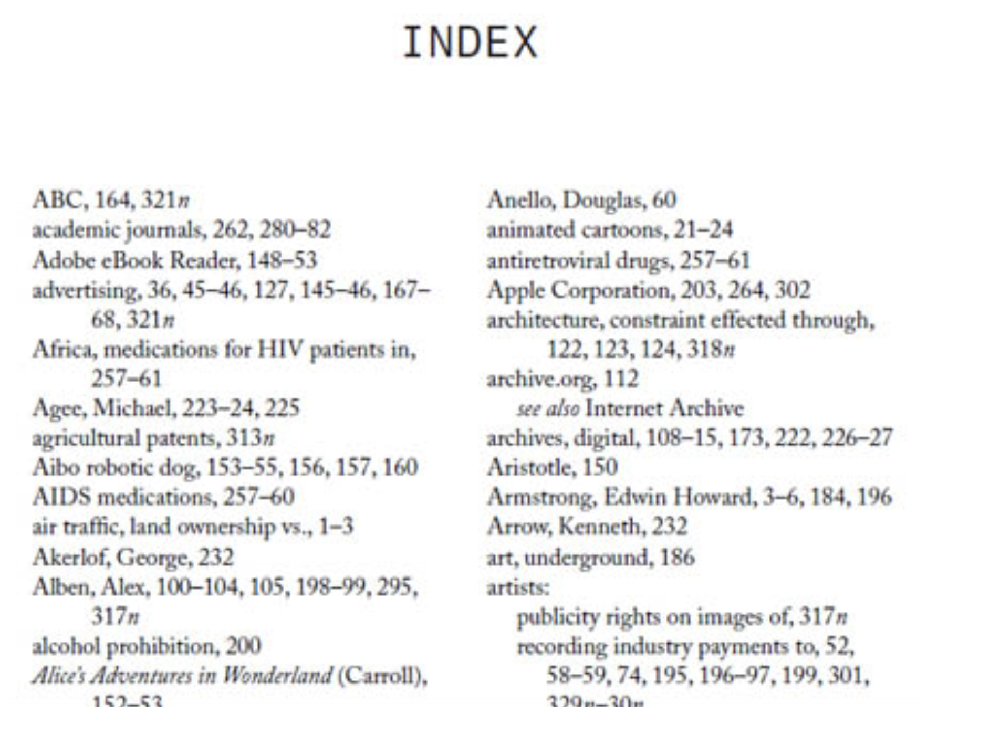
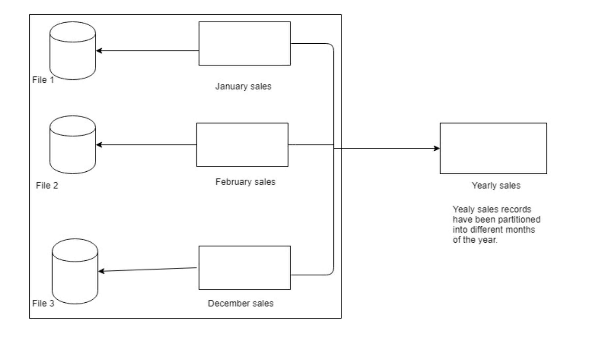

# Databases Overview 

## Introduction

+ **Data** - can be facts related to any object in consideration e.g. your name, height, age are some data related to you. This is in the context of computer system.+

+ **Database(DB)** - a systematic collection of data (in a computer system) to help in storage and manipulation of data. 
    + You can adopt the following folder structure for system organization of data:
        + **Option 1: Tables** 
            + **students.txt** - file containing students data
                + **Column Headers:**
                    ```yaml
                    admin_no|student_name|dob|home_county|admin_date|class
                + **Sample records:**
                    ```yaml
                    1001|Rexvin Mwangi|2008-09-22|Kiambu|2020-02-05|8S
                    1002|Joy Kendi|2008-11-26|Tharaka|2019-03-07|8W
            + **teachers.txt** - file containing teachers data
                + **Column Headers:**
                    ```yaml
                    staff_no|teacher_name|id_no|dob|tsc_no|home_county|join_date
                + **Sample records:**
                    ```yaml
                    101|John Mugendi|10010010|1975-02-05|622828|Tharaka|2016-02-05
                    102|Johannes Opiyo|24310010|1983-08-22|34535345|Homa Bay|2019-05-01
            + **classes.txt:** - file containing classes data
                + **Column Headers:**
                    ```yaml
                    class|class_teacher
                + **Sample records:**
                    ```yaml
                    8W|102
                    8S|101
            
    + **Option 2: Collections**
        + **students.json** - file containing students data 

            ```yaml
            [
                {
                    "id":"1001",
                    "name": "Rexvin Mwangi",
                    "dob": "2008-09-22",
                    "county":"Kiambu",
                    "admin_date": "2020-02-05",
                    "class": "8S"
                },
                {
                    "id":"1002",
                    "name": "Joy Kendi",
                    "dob": "2008-11-26",
                    "county":"Tharaka",
                    "admin_date": "2019-03-07",
                    "class": "8W"
                }
            ]

    + **Data storage**:
        + In my experience as an engineer, all database management systems that I have come across **store data on a physical storage** -disk on a computer (HDD or SSD). 
        + **Tables** or **Collections** are represented as **files on disk**. This means that for every collection or table, you will find a corresponding file or files on disk. 

    + **Dababase Management System (DBMS)** is a software that handles storage, retrieval and updating of data in the computer system. 

    + Read on **SQL versus NoSQL** databamases. 

    + **Naming of tables - Plural or Singular?**
        + There is no consensus among developers, however this is my preference:
            + **Entity objects** in code - **SINGULAR** e.g. Student object 
            + **Database tables** - PLURAL with a prefix e.g. tbl_students
                + **tbl** - a prefix to indicate that it is a table 
                    + In databases you can have other object types e.g. sequences, views, indexes, trigggers, stored procedures, functions and a prefix convention may help in organizing your database objects. 
                + **students** the name of objects stored in the table ***students**
        + Make your choice and **be consistent**. 
    

## Database Management System (DBMS)

**Definition:** - DBMS is a Software that handles storage, retrieval and updating of data (in a database) in a computer system. 

Example DBMS include:
+ MySQL - SQL 
+ MongoDB - NoSQL
+ Oracle - SQL
+ Apache Cassandra - NoSQL  
+ PostgresSQL - SQL 

**Important notes:**
+ Though the data is in disk, we do not modify the manually using text editor.
+ In case we need **to add, update or delete some data, the request is  sent the software** (you can think of an OS service) and the software does the magic of updating the files on disk accordingly.
+ Most DDMS support communication via the network, they run as services on the OS and expose a port for access:
    + MySQL default port is 3306
    + MongoDB default port is 27017 
    + Oracle default port is 1521 
    + Apache Cassandra default port is 9042
    + PostgresSQL default port is is 5432
+ For security and optimization reasons, some DBMS store the data in **binary format**. Meaning that the files cannot be viewed with a text editor. 

## MySQL Commands and SQL Statements 

_NOTE: In case you are using a different DBMS, consider the equivalent commands and queries._

In this section, we will use MySQL to illustrate some of the database concepts and below some of the commands that are helpful. 

+ **Linux commands** - run on the shell
    + **mysql command** - mysql client command, you can use this to connect to a database. You must install mysql client on the server. 
        + _mysql --host=127.0.0.1 --port=3306 -u root -p_
    + **mysql service management**
        + check status:
            + service mysqld status or /bin/systemctl status  mysqld.service

        + start:
            + service mysqld start or /bin/systemctl start  mysqld.service

        + stop:
            + service mysqld stop or /bin/systemctl stop  mysqld.service

        + restart:
            + service mysqld restart or /bin/systemctl restart  mysqld.service

+ **SQL Commands** - run once connected to the database.      

    + **show databases** - list all databases the user has access to. 
        + _show databases;_
    + **use <database_name>** - used to select a database to use in the session.
        + _use my_app_db;_
    + **show tables** - lists the tables in the selected database. 
        + _show tables;_
    + **descibe table** - used to describe the table - prints the structure of database. 
        + _desc students;_
    + **show create table** - shows the SQL statement that can be used in creating the table
        + _show create table tbl_students_ 
    + **show processlist** - queries run as processes with the database. This command lists all queries that are running in your database. 
        + _show processlist_ - shows brief information 
        + _show full proceslist_ - shows the full query
    + **kill a process** - kill a process(a query) - may be the query is taking too long and affecting the system performance (may the database has locked the db)
        + _kill processid;_- process id is from show processlist
        + e.g. _kill 147615810;_ 
    + **explain command** - used to give you information on how the query will perform if run [gives index and partition information - see Indexing and Partitioning]
        + _explain select * from tbl_students;_

    + **copy table structure** - copy a table structure, probably you want to archive(rename) the live table and use a new one. 
        + CREATE TABLE tbl_students_new  LIKE tbl_students;

    + **rename** - rename a table to another name. We use it for manual archival and backing up. 
        + _RENAME TABLE tbl_students_new TO tbl_students;_

    + **select and insert into another table** - useful in operations. 
        + _INSERT INTO tbl_students_new SELECT * FROM tbl_students where admin_date > '199-12-31';_ - you want to copy all students admitted from 2000 into the new table 


## Important Database Concepts

### Indexing

Think of the effect of an INDEX in a book:



A database index is a structure that  improves the time for data retrieval. They are used to quickly locate data without having to scan through each and every row on the slow disks every time a database table is accessed.

**IMPORTANT:** For most DBMSes the Index is stored in memory (leading to fast acces). 
    + Querying INDEX is fast - memory. 
    + Query DISK is slow (compared to memory). 

+ **How queries are executed in a DBMS using an INDEX**:

    + **Query analysing and optimization** - determines the most optimal query and identifies the indexes and partitions to be checked. 

    + **Check Index** - check for the records that match and their respective locations on the files on disk. 

    + **Retrieve data from cache** - in case the db supports caching (if data is not found, we go to disk)

    + **Retrieve data from disk** - using the data in the previos step 

+ **How queries are executed WITHOUT an INDEX**:
    + Query analysing and optimization 
    + Retrieve data from cache (if a previous query had been run) 
    + Retrieve data from disk - **FULL TABLE SCAN** (very slow). 

+ Additional notes:
    + Primary keys is an INDEX (if you use primary key in where clause, the query will be pretty fast)
    + INDEXing improves SELECTs greatly and affects speed of inserts and udpates (neglible effect in most DBMS):
        + INDEX is updated on INSERT 
        + INDEX may be updated on UPDATE 
        + INDEX is updated on DELETE 
    + If your db has a few thousand records, you can be forgiven for not INDEXING. In case you are dealing with millions of records every day, it will be impossible to run an application without factoring INDEXing. 
    + INDEXing is part of database and query optimizations. 

### Partitioning 

Partitioning allows tables, indexes and indexed organized tables to be subdivided into smaller chunks, enabling these database objects to be accessed and managed at finer granular levels.

**Consider this practical example:**
+ Consider having partitions based on the month of the year. 
+ This forms a subdivision of data that can be accessed more easily. Any subset of data can be easily retrieved from a particular month of the year.
+ This means that you won't scan all the records of the year. Practically, this is pretty fast.


**Consider an alternative:**
+ Consider having a single partition having all the records of the year 2018. 
+ Assume you want to search for records of a particular day of the month.
+ You will have to scan through all the records of the year. Practically, his will use more time.




### Database Connection Pooling 

It is costly to establish a connection to the server every time you want to read or write to the database. Connection pooling gives a better way of managing connections to the server.

+ Connection pooling is a cache of database connections that is maintained so that the connections can be reused when future requests are made.

+ Establishing a new connection every time the user wants to access the database may be so costly.

+ When an application needs to connect to the database, it will be disadvantageous if it needs to connect every time the user is sending a request for a particular data. So the server maintains a pool of connection instances. If the request comes it will take an instance from the pool and start sending the request.

+ If an application connects to the database without taking advantage of connection pooling, the following steps have to be executed. 
    + A TCP connection is established (TCP Handshake).
    + Authentication
    + Selecting the database
    + Reads/writes to the database
    + Connection is closed.
+ The handshake and authentication steps affect overall query performance by a few milliseconds. You can execute an insert in 0 or 1 millisecond using connection pool but it will be difficult to achieve the same without connection pooling. 


## Optimization 

Database optimization is the strategy of reducing database system response time. 

It involves a wide range of strategies:

+ Indexing 
+ Partitioning 
+ Memory adjustment - how much memory is available to the DBMS
+ Flushing data to disk strategies
+ etc... 


## Migrations (do not confuse with Data Migration)

Think of versioning and tracking DB changes and applying the changes automatically as part of DevSecOps. 

If the lifetime of a software, you may need to add a column to an existing table in an SQL db or add a new table in the database. Migration tools help us accomplish tracking and applying changes as our software evolves. Without them, you may need to do DB changes manually and this may prevent you from achieving true DevSecOps. 

Check out: https://www.liquibase.org/

## Database Replication & Backups 

Bonus session to be done later. 


