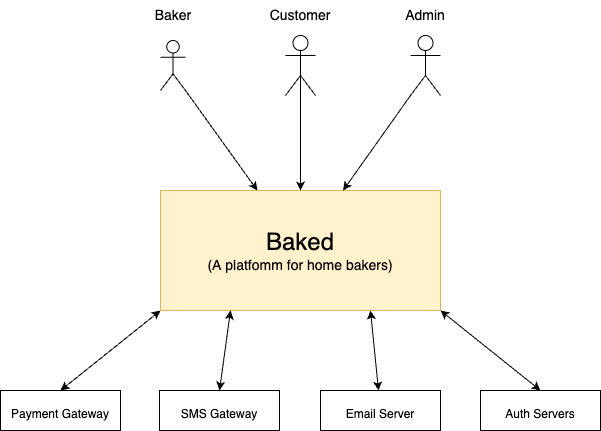
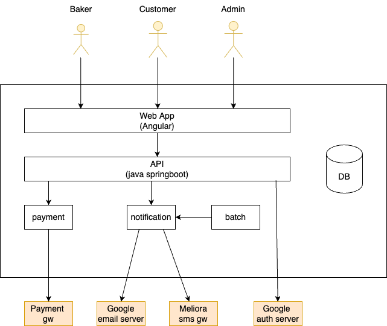
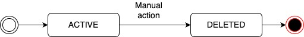
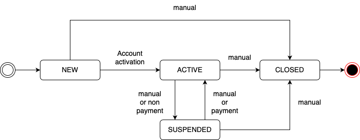
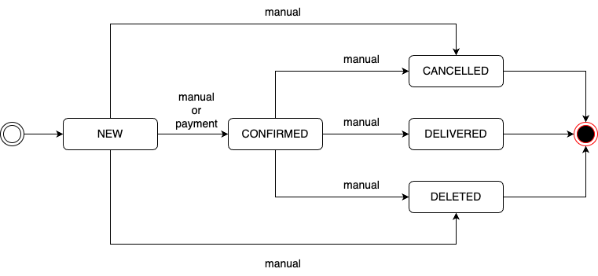

# Baked - NatujengeOYF Hackathon Project 

## 1.0. Introduction 

### 1.1. Purpose 

We want to build a platform that will help improve home baker's busieness operations required for their growth. 

This project is being executed as part of the [NatujengeOYF](https://meliora.co.ke/articles/nvrjgtnsgh5ophs6mm) hackathon challenges. 

### 1.2. Product Scope 
We want to build a platform for home bakers. The platform will be used in their day to day operations and will help them in the following areas:
+ **Customer engagement** - system generated notifications at various stages of customer and order management life cycle. 
+ **Customer experience measurement(CEM)** - get feedback from customers to help you improve and grow your business. 
+ **Customer value management (CVM)** - help bakers not to miss on any repeat business and/or new opportunities.
+ **Business operations** - add efficiency to the home baker's business operations. In built reminders for the bakers; order and repeat business to the bakers.  

### 1.3. Definitions, Accronyms and Abbreviations 
+ None 

# 2.0. Overall Solution Description 

## 2.1. Overall Perspective

The diagram below shows the context diagram of the solution to be developed in the first sprint (the diagram will be modified as we add more features according to road map). 

Summary of the external actors and systems:
+ Actors:
    + Baker - user 
    + Customer - user
    + Admin - user 

+ Interfacing Systems:
    + SMS Gateway - send SMS using [Tiara Connect API](https://www.tiaraconnect.io/developer) or standard SMPP v3.4
    + Email Server - send email API, SMTP server
    + Auth Server - authenticate user using Google Auth Server 
    + Payment Gateway* - process baker and customer payment (To be defined in Sprint 2)

Note: * - may not be included in the first sprint.  

## 2.2. Product Functions 

Below is a list of the main product functions in the system: 
+ Baker management 
+ Customer management 
+ Order management 
+ Payment management 
+ Authentication and authorization 

## 2.3. System Users & their Characteristics 

+ User 1: baker:
    + main channels: Web via mobile or laptop 
    + other channels:
        + SMS - notifications 
        + Email - notifications 
    + characteristics:
        + will mainly access service via a smart phone
        + will be using this system on a day to day basis 
        + main functions include: customer, order and payment management   
+ User 2: customer 
    + main channel: SMS and Email - notifications 
    + other channels:
        + Web - feedback form
    + characteristics:
        + has a mobile phone and probably an email account 
        + mainly receives notifications from the system 
        + interact with the public web to give feedback (first release features)

+ User 3: Admin 
    + main channel: Web via laptop 
    + other channels:
        + Email - notifications 
    + characteristics:
        + an employee and does admin functions - mainly managing bakers profiles and other system configurations 

## 2.4. Operting Environment 
+ The solution should be built to run on the cloud

## 2.5. Design and implementation considerations
+ None 

## 2.6. User Documentation 
+ Requirements document 
+ Architecture document 
+ User guide* 
+ Technical operations guide 

## 2.7. Assumptions and Dependancies 
+ None 

## 2.8. Assumptions and Dependancies 
+ None 

# 3.0 External Interface Requirements 
## 3.1. User Interfaces 
+ Web:
    + bakers, customers and admins will access the web 
    + It is the main user interface 
    + It should be mobile friendly to baker and customer 

+ SMS:
    + Notifications to bakers and customers 

+ Email:
    + Notifications to bakers and customers 

## 3.2. Hardware Interfaces 
+ None 

## 3.3. Software Interfaces 
+ SMS Gateway API - Tiara Connect (by Meliora) SMS API Specification/SMPP ver 3.4 
+ Email Server API - SMTP 
+ Auth Servers - Google API 

## 3.4. Communication Interfaces 
+ None 

# 4.0 Functional Requirements

## 4.1. Sprint 1 Features

+ Feat 1: Authentication requirements
    + Feat 1.1: Sign up baker using email address (local credentials)
    + Feat 1.2: Sign up baker using Google 
    + Feat 1.3: Sign in baker using local credentials
    + Feat 1.4: Sign in baker using Google
    + Feat 1.5: Reset baker password (local credentials)
    + Feat 1.6: Change baker password (local credentials)

+ Feat 2: Authorization requirements:
    + Feat 2.1: admin role
        + should have role to manage bakers and their statuses only 
        + should be able to view the notifications
        + should NOT view bakers data 
    + Feat 2.1: baker role 
        + should manage bakers data and any related data (orders, paymaents, notifications, etc.)

+ Feat 3: Baker management
    + Feat 3.1: Sign up baker using local credentials - same as Feat 1.1 
    + Feat 3.2: Sign up baker using Google - same as Feat 1.2
    + Feat 3.3: List and search bakers (admin role) 
    + Feat 3.4: Suspend baker profile (admin role) 
    + Feat 3.5: Unspend/Activate baker profile (admin role) 
    + Feat 3.6: Close baker profile (admin role) 
    + Feat 3.7: Set/change baker payment details 
    + Feat 3.8: Set/change baker profile logo 
    + Feat 3.9: Set/change baker notification settings 
    + Feat 3.10: Set/change baker notification templates  
    + Feat 3.11: View baker profile (admin and baker roles)

+ Feat 4: Customer Management
    + Feat 4.1: Create customer 
    + Feat 4.2: Suspend customer 
    + Feat 4.3: Activate/Unsuspend customer 
    + Feat 4.3: Close customer 
    + Feat 4.4: Update customer details 
    + Feat 4.5: View customer  

+ Feat 5: Order Management 
    + Feat 5.1: Create order 
    + Feat 5.2: Update order details (except amounts) 
    + Feat 5.3: Confirm order 
    + Feat 5.4: Cancel order 
    + Feat 5:5: Mark order as delivered 
    + Feat 5.6: Delete order 
    + Feat 5.7: View order  

+ Feat 6: Payment (Order) Management 
    + Feat 6.1: Record payment (positive adjustment)
    + Feat 6.2: Negative adjustment
    + Feat 5.7: View payment

## 4.2. Roadmap Features 
+ Feat 20: Payment Integration for baker and customer payments
    + Feat 20.1: Baker can load their wallet online 
    + Feat 20.2: Customer can make an online payment for an order 
    + Feat 20.3: Customer can make an online payment for an order

+ Feat 21: Baker and customer wallets
    + Feat 21.1: A baker should have a wallet - create during baker onboarding
    + Feat 21.2: View wallet 
    + Feat 21.3: View wallet statement 
    + Feat 21.4: Top-up wallet  
    + Feat 21.4: Adjust wallet balance (admin role) 

+ Feat 22: Baker service billing
    + Feat 22.1: A baker should SMS credit units
    + Feat 22.2: Renewal of monthly subscription plan bundle based on the subscription plan (e.g. load 100 SMS for KES 200)
    + Feat 22.3: Real time billing of SMS from baker SMS wallet 
    + Feat 22.4: Real time billing of SMS from baker money wallet

+ Feat 23: Sales pipeline
    + Feat 23.1: View sales pipeline - future sales based on historical data 
    + Feat 23.2: Call the customers 
    + Feat 23.3: Send an order notification to the customer 
    + Feat 23.4: Schedule a gift to the customer - Customer Value Management 

+ Feat 24: Bakers product catalog 

+ Feat 25: Online bakers directory

+ Feat 26: Inventory management 

+ Feat 27: Price calculator 

+ Feat 28: Reports and analytics:
    + Feat 24.1: Generate and view sales revenue report (money)  
    + Feat 24.2: Generate and view customer revenue report (money)
    + Feat 24.3: Generate and view order report (orders)

+ Feat 29: Invoice management 

+ Feat 30: Tax management 

+ Feat 30: Offers management (works with bakers directoy)

# 5.0. Non Functional Requirements

+ Data archival and deletion - the system should have a provision to delete data marked for deletion. 
+ Web app to generate data or logs that can be used to measure customer experience on the web app. 
+ Order numbers and payment reference numbers should not be auto increment numbers for security reasons. The system should have an algorthm to do the same. 

# 6.0. High Level Architecture (HLD)  

In HLD, we decompose the system into modules (or services) that work together. We are meant to define the following: 

+ Define the components or services 
+ Define the functions/boundaries of the components (what a component does and where necessary what the module should not do)
+ Define the interfaces exposed and consumed by a components. At this stage, API specifications for internal communication are defined. 
+ Define any data stores shared by the components. 

**Note:** Above steps can be used iteratively for each component. 

In this section, we will be decomposing the diagram in section 2.1 to internal modules within our baked platform. Below is a diagram representing the various components that will make up our service. 

Note: We are using this architecture to aid us in rapid development of the MVP. In future, we may revise the architecture. 

## 6.1. Web App

This will be an Angular project whose main function is to:

+ Be the web user interface for the baker.
+ Be the web user interface for the customer.
+ Be the web user interface for the admin user.
+ Retrieve data from the backend service through API service ONLY.

## 6.2. Dabatabase (DB) Service 

Since our application is relatively simple, the system will store the baker, custommer, order, payment and user data in one single database (candidate for review in future architecture). 

We will be using MySQL database for this project. 

## 6.2. API service 
This will be a spring boot project that will host all the APIs to the data model in this platform. 

The following APIs need to be exposed via API service: 

+ Authentication and authorization APIs (local and Google) 
+ Baker management APIs 
+ Customer management APIs 
+ Order management APIs 
+ Payment management APIs 

The APIs exposed will be: 
+ REST APIs 
+ Authenticated using JWT tokens generated at the time of login and/or refreshed periodically 
+ Authorization of APIs based on role and baker id:
    + Data retrieved will be based on the bakerid claim on the JWT token  (a baker cannot view data for another data via API)
+ Filter by APIs will be defined based on the designed customer experience 
+ Use DTOs where we need to combine from more than one domain object. 

**Incoming APIs:**
+ All above - developers to define the APIs. 

**Outgoing APIs:**
+ Send notification service - for events that need to send email or SMS
+ Google auth service API 

## 6.3. Notification Service 

We will be re-using an existing notification service module by Meliora that will provide a REST API to send email and sms notifications. 

The service is response for: 
+ Creating and maintaining connection to the SMS gateway 
+ Creating and maintaining connection to the Email or SMTP server 
+ Expose a REST/JSON based API for send email and SMS. 
+ Be responsible for transforming the incoming JSON request to SMTP and SMPP request for email and SMS respectively
+ Receive and process delivery receipts for SMS messages sent via the account

**Incoming APIs:**
+ Send notification - TO BE PROVIDED from the notification service 

**Outgoing APIs:**
+ Send SMS api to SMS Gateway [external]
+ Send Email API to SMTP server [external]

## 6.4. Payment Service 

This service will be reprensible for the following: 

+ Connecting to the payment gateway for online checkout integration 
+ Receive payment confirmation callbacks 
+ Receive instant payment notifications - for customers paid outside the platform e.g. C2B from M-PESA app 
+ Forward the payment requests to the responsible modules (e.g. accounting service)
+ Validate the source of the payment notifications and callbacks before posting the amount (security design)

**Incoming APIs:**
+ Initiative payment for online checkout towards payment gateway 
+ Receive payment confirmation callback (for requests initiated from the service)
+ Receive instant payment notifications (for payments initiated by the customer outside baked, e.g. from M-PESA app)

**Note** This service will be developed in the second sprint. 

## 6.5. Batch Service 

This service is resposible for the following:
+ Scanning for orders due for processing and generating the relevant notifications
+ Scanning for orders recorded previously and identify new sales lead and generate notifications to the baker 

The batch service will be running every day at night and schedule messages for sending in the morning. 

# 7.0. Data Modelling 

The following sub-sections will define the model objects identified to help us achieve the product functions for the first sprint.

Each model is expected to have the following generic fields for audit purpose and data life cycle management: 
+ created_at 
+ created_by 
+ last_updated_at
+ last_updated_by 
+ content_status:
    + ACTIVE - default status for all object 
    + DELETED 

**Content State Transition Diagram**

Allowed state transitions for the content_status: 

Note: Data marked as DELETED will be archived and deleted using an archival job. 

## 7.1. User 
Default system user model to be adopted with a few modifications.  Additional fields: 

+ baker_id - a user can belong to a baker.
+ reg_mode:
    + LOCAL - use local credentials 
    + GOOGLE - google

**Note:** During creation of a baker, we need to add a user and a baker and link the user to the baker. 

## 7.2. Baker
A baker object will have the following attributes: 
+ id 
+ business_name - name of the business
+ full_names - name of the person registering 
+ msisdn - mobile number 
+ email_address - email address used in registration... 
+ location_info:
    + country e.g. KE 
    + region/county e.g. Kiambu 
    + town e.g. Ruiru 
    + physical_address e.g. Gatong'ora
    + latitue and longitude information e.g. co-ordinates
+ status:
    + NEW - default for all newly created bakers
    + ACTIVE - when account is activated
    + SUSPENDED - account suspended manually or automatically by the system 
    + CLOSED - when a bakers decides to close or delete their account 
+ reason - reason for the status above 
+ payment_details - to be used in order notifications 
    + payment_type:
        + BUY GOODS
        + PAY BILL
        + SEND MONEY
        + POCHI LA BIASHARA 
        + BANK - future 
    + msisdn - applies for pochi and send money 
    + till_number - used for pay bill and buy goods 
    + account_number - used for pay bill
    + deposit_percentage - pealrcentage of money needed to confirm an order/deposit amount as a percentage of the total invoice amount 
+ baker_settings:
    + logo 
    + notification_settings:
        + customer_notification_mode - notifications mode for the baker 
            + SMS - send sms only 
            + Email - send email only 
            + SMS and Email - send email and sms where applicable 
            + None - no notifications to be sent
        + sms_display_name - e.g. CAKEYARD de
        + email_display_name - e.g. Cakeyard 
        + notification_templates:
            + new_order_template:
                + enable - default is true 
                + email 
                + sms 
            + partial_order_payment_template:
                + enable - default is true
                + email 
                + sms 
            + full_order_payment_template:
                + enable - default is true
                + email 
                + sms 
            + cancel_order_template:
                + enable - default is true
                + email 
                + sms 
            + deliver_order_template:
                + enable - default is true
                + email 
                + sms

**Baker state transition diagram:**

Note:
+ Order management processes need to check the notification settings and generate the relevant notifications accordingly
+ Email templates to use the company logo 

## 7.3. Customer 

A customer object will have the following attributes:
+ id 
+ name 
+ type:
    + INDIVIDUAL - defualt 
    + CORPORATE 
+ msisdn - mobile number to used for notifications based on baker settings 
+ email_address - to be used for notifications based on baker settings 
+ physical_address - to be used in deliveries (defualt value to be used in the order)
+ payment_mode:
    + prepay - default 
    + postpay - can be used for corporates mostly or trusted individuals 
+ status:
    + ACTIVE 
    + SUSPENDED 
    + CLOSED 
+ reason - reason for the status 

**Customer state transition diagram:**

Notes:
+ type of customer can be used to provide a different notification model e.g. get feedback from the staff member instead of the customer who order  e.g. case of staff member getting a cake from company 
+ A baker can suspend or close a customer they created... we need to validate that the customer was actually created by the baker who changes their status 

## 7.4. Order 

An order object will have the following attributes:
+ id 
+ order_no 
+ name 
+ type:
    + BIRTHDAY 
    + ANNIVERSARY
    + OTHER 
+ details - detailed info on the order to help the baker deliver according to specs 
+ notes - special notes to be displayed in a notable manner on the order display panel  
+ order_amount 
+ amount_paid 
+ order_date - when the order was place - defaults to creation date 
+ delivery_date - when the order will be delivered - set at the time of placing the order 
+ delivered_at - the date and time when the order was delivered - updated when the order is marked as delivered 
+ status:
    + NEW - just created order and deposit not paid - default status 
    + CONFIRMED - updated when the deposit amount is paid/recorded or manually by the baker 
    + CANCELLED - cancelled by the baker, reason provided 
    + DELIVERED - delivered by the baker 
    + DELETED - order deleted and to be removed from the system 
+ reason - reason for status above 
+ delivery_address - where the order will be delivered 
+ attachments - CAN BE an external table
    + a list of attachments to be used by the baker for reference during the baking e.g. images 
    + fields:
        + id 
        + data - blob  
        + order_id - foreign key to order.id 

+ customer_id - foreign key to customer.id  
+ baker_id - foreign key to baker.id - add it for performance reasons 

**Order state transition diagram:**

Note:
+ Order number will be generated by the system and will contain alphanumeric values - an algorithm to generate the number will have to be defined - part of process flow to be defined. 
+ We can pick the defauult customer.physical_address as delivery_address for order by default
+ Order state management status diagram is needed (ADD A DIAGRAM for the objects)

## 7.4. Payment 
An payment object will have the following attributes:
+ id 
+ payment_ref - internally generated payment number 
+ ext_payment_ref - payment ref number from external system (optional) 

+ mode_of_payment:
    + MANUAL - default - payment recorded manually by the baker via web app 
    + AUTO - automatic payment from payment processing service - to be delivered in a later sprint 
+ amount 
+ balance_after - order balance after this payment was made
+ narration - comments given at the time of payment 

+ order_id - foreign key to order.id 
+ customer_id - foreign key to customer.id - added for optimization of queries 
+ baker_id - foreign key to baker.id - added for optimization of queries and processing 

+ paid_at - time and date of payment - defaults to the date and time of processing the payment 

Notes:
+ we need to have a reference number generation algorithm 
+ Payment processing may affect the order status, this needs to be taken care of in the payment processing flow. 

## 7.4. Notification 
An payment object will have the following attributes:
+ id
+ type:
    + SMS 
    + EMAIL 
+ subject 
+ from 
+ to 
+ content - large field to include the email content  
+ sent_at 
+ send_status
+ send_reason 
+ delivered_at 
+ delivery_status 
+ units - message units consumed for this service - important for sms that incurs a cost 
+ cost - 2 
+ currency - KES 

+ baker_id - foreign key to baker.id 
+ customer_id - foreign key to customer.id - can be null 
+ order_id - foreign key to order.id - can be null 
+ payment_id - foreign key to payment.id - can be null 

Notes:
+ The notifications table will be used as part of service billing - more work to be done in the second sprint. 
+ Notification service should be able to send back the delivery status back to the API service for updating of the database object. 

# 8.0. Experience Modelling

# 9.0. Process Modelling

## 9.1. Authentication Process 
+ P1: Authentication processes:
    + P1.1: Sign up process using local credentials 
        + Step 1: Capture the following details:
            + Full Names - mandatory 
            + Business Name - mandatory 
            + Email address - mandatory 
            + Mobile Number - mandatory 
        + Step 2: Validate mobile number using an OTP 
        + Step 3: Submit the registration request:
            + create a user account 
            + create a baker record in status - NEW status is the default
            + Send activation email - email verification 
        + Step 4: Activate the account 
    + P1.2: Sign up using Google 
        + Step 1: sign up with Google 
        + Step 2: redirect the user to Google auth 
        + Step 3: create the user and baker 
        + step 4: auto login 
    + P1.3: Sign in using local credentials - email address + password 
        + default process 
    + P1.4: Sign in using Google 
        + default process 
    + P1.5: Reset baker password:
        + default process 
    + P1.6: Reset baker password:
        + default process 

+ P2: Authorization processes
    + default process

## 9.2. Baker Creation/Registration Process

The following are some of key elements to note in the baker creation process:

+ Bakers can register manually or use Google account to sign up. At the end of the process, we will capture:
    + full names - person 
    + business name 
    + email address 
    + phone number 
    + location information:
        + we can capture implicitly - use location... 

+ Set the default notification templates for the baker

+ We will use above information to:
    + Create a baker 
    + Create a user 
    + Assign baker to user 

+ IF the reg_mode is Google THEN
    + activate the account and sign in the user automatically 
+ ELSE 
    + send an activation email and notify the user to check their mail box 

Note: 
+ Manual will require verification of the mobile number as part of the user experience

 ## 9.3. Order Creation Process

 The order creation process will involve the following proces:
 + Creation of the order
 + Generation of order number - order number algorithm 
 + Saving it into the database 
 + Sending out order notifications:
    + IF customer has msisdn set THEN
        + Get the baker order_create_notification sms template 
        + Replace it with order, baker and payment details 
        + Send an SMS notification to the customer.msisdn via the notification service 

    + IF customer has email_address set THEN 
        + Get the order create notification email template 
        + Replace the variables with the order, baker and payment details
        + Send an SMS notification to the customer.email_address via the notification service 

 ## 9.3. Order Status Management Process

This process covers; cancellation, confirmation, deletion and delivery:
+ Change the order status and the narration  and save 
+ Check the notification template from baker settings and generate the sms and email notifications if the customer msisdn and email address exist respectively. 

Note: Delete and cofirm order states do not send out notifications based on the baker's notification templates.

## 9.4. Payment Processing 

The following need to be considered in the order payment processing (manual payments for now): 

+ Adjust the order amount_paid accordingly 
+ Compute the if the amount paid is enough for order confirmation - check baker payment settings - order deposit percentage 
+ If the total amount paid is higher than deposit amount and order status is NEW:
    + we need to set the order status to CONFIRMED 
+ If order total amount paid is same as the order amount (full payment) THEN 
    + generate notifications to customers based on the full payment notification template from the baker profile 

+ else the payment is partial then 
    + generate customer notifications using the partial payment notification template from the baker profile 

+ Others:
    + Performance optimization:
        + Archival of old data - orders made a few years ago... 
        + Indexing based on baker id in the key tables:
            + customer 
            + Orders 
        + Indexing based on order id:
            + payment 
            + notifications

    + Others:
        + bakers should be able to key in historical data into the system... orders made last year:
            + historical order - no notifications should be sent to the customers... 

## 9.5. Order Reminders Process 

This is the process to be used to remind bakers of the orders that are pending and due in the near future.

Note: This process will be defined by the development team. 

# 10.0. Others 

To do:
+ Experince 