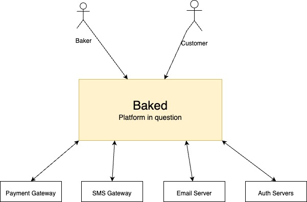
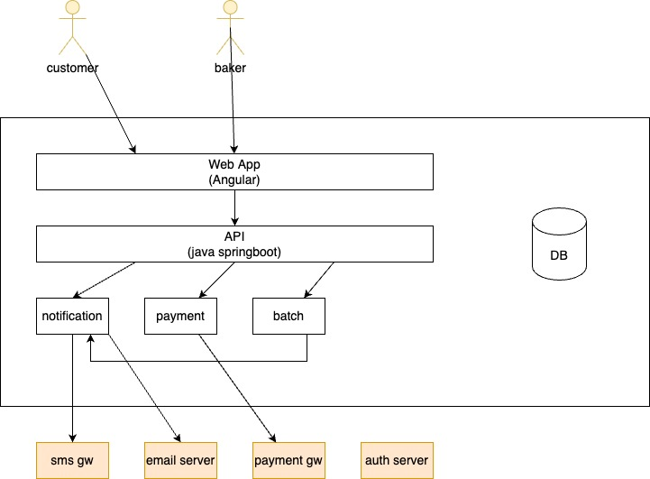

# Julisha or Baked Project

+ Problem Statement:
    + Julisha - a swahili - to inform someone + notify + remind 
    + Remind people of what they should be reminded of:
        + Forget your partner's birthday, anniversary... - general public
        + Remind sick people to take medicine... 
        + Remind them of an appointment... 
        + special group:
            + bakers... people who bake cakes - home bakers.... 
            + a lot of their operations is manual...
    + We will limit the scope (person of interest) 
        + Home bakers:
            + characteristics:
                + tech savvy - probably on social media... they have a phone/smart phone in that case... 
                + they are passionate about their product.... 
                + they can speak english... - no need for multilingual... 
                + They tend to be organized and need to run on a schedule in order to deliver quality goods on time.
                + they take orders... 
                + they love feedback 
                + they common recipe for their products... 
                + they multi-task.... 
                + they have some delivery delivery arrangements... 
                + they have preferred ingredients...

            + challenges do they face:
                + keeping records... 
                + clear communication with the customers... 
                + accuracy with ingredients... 
                + keeping track of their recipes 
                + inventory management... 
                + managing orders... 
                + managing historical orders for the sake of business next year:
                    + 15th July 2022 - a birthday cake:
                        + next year 2023 -  you need to be reminded of the customers, X days before... 
            + know a baker? 
                + challenge:
                    + validate our assumptions... about their characteristics and the challenges they face... 
                    + validate our anchor challenge - communication and engagement -> grow their business by being organized and ensuring that they do not miss out on opportunity:
                        + Order notifications - tell them thank you via SMS... CAKEYARD
                        + Feedback - being able to get feedback from the customers on the services offered... 
                        + Reminded of the potential sales for future based on historical data:
                            + Sale on July 15 2022 to Molly birthday cake/anniversary - in 2023 - we want the business to make another sale... 
                        + order placed and you want to be reminded:
                            + next month on November 2022 and you want to be reminded...
                + is this a potential business:
                    + bakers.... 
                        + thousands..... 
                        + help them build brand....   
                    + business:
                        + baker is willing to pay KES 100 per month:
                            + for the service... 
                            + 1000 bakers - 100K per month 
                            + 10,000 bakers - 1M per month... 
                + talk to a baker:
                    + share idea of communication and engagement:
                        + customer engagement:
                            + on orders - trigger an SMS 
                            + save the record for the reminder.... 
                        + reminders to the baker
                    + would they be willing to pay? 
                    + how much they are willing to pay for this service per month?   
                    + what are their biggest challenges?     

+ Problem:
    + a home baker in two areas (web app based - mobile friendly)
    + A home baker who has challenges in engaging with their customers:
        + delivery thank you messages... 
        + order messages... we have received your order and we are happy to serve you... 
        + get feedback - can you do a survey after the delivery:
            + after sales survey... 
        + reminders for orders delivery - repeatitive/anniverary based orders... 
    + We want to improve how home bakers engage with their customers - make things efficients:
        + start with basically notificiations driven use case... 
        + other products...

+ Person - who has a problem 
    + baker - the main person... 
    + customer - who buys who buys the cake... 
        + have a phone and can receive an sms  
        + they have a smart phone and can access web page to fill in a survey... 
    + users:
        + baker will use the system:
            + channels:
                + web app (mobile friendly)
                + sms channel - notifications via SMS/email/etc... 
        + the customer will interact the system:
            + receive notifications - thank you messages... 
            + giving feedback:
                + sms could contain a link - HOW
                + sms via short code - interactive survey via SMS - HOW 

+ Context:
    + Environment - actors and systems in the environment: 
        + bakers 
        + customers
        + messaging platforms:
            + sms gateway - 
            + email server - send emails to customes 
            + auth server - google server for auth... 
                + username and password should not be local... 
                + sign in with:
                    + Google 
                    + Facebook

+ Requirements modelling - SRS - Software Requirements Specifications (SRS) + BRD + SDD 

    + Introduction:
        + Purpose:
            + Build a customer engagement platform for the bakers. The platform will be used in ensuring that:
                + the bakers communicate and get feedback from customers:
                    + confirm order placed:
                        + confirm delivery dates, price and payment details... 
                    + confirm delivered orders...:
                        + thank you message and feedback link.. 
                + a tool to remind bakers of future events (reminders) - orders and potential sales... 
                    + order that has been placed... next week on Thursday [remind baker 3 days to the d-day]
                    + future sale - remind them 1month and/or 2 weeks to the birthday
        + Product Scope 
            + Building a web app that will allow:
                + the bakers communicate and get feedback from customers 
                + a tool to remind them of future events - orders and potential sales... 
            + integration to messsaging platforms:
                + sending notifications via SMS and email... 
    
        + Definitions, Accroynms and abbreviations

    + Overall Description 
        + Overall perspective: 
            + 3 parts:
                + Northbound actors - systems and people who connect to you: 
                    + Baker - User 
                    + Customer - User

                + System - new platform or solutuion:
                    + Blackbox - we will break into parts during the high level and low level design... 

                + Southbound actors - systems you connect to: 
                    + SMS Gateway - tiara connect [api for sending SMS]
                    + Email Server - sending email [gmail servers for sending emails]
                        + info@julisha.com... 
                    + Authentications servers:
                        + social logins:
                            + Google  - start with Google... 
                            + Facebook
                    + Payment Gateway
                    
            + You can now draw context diagram... 

            

        + Product Functions:
            + A baker should be able to place an order on a system:
                + Capture the order name and finer details and an attachment..... 
                + System should trigger notification to customer automatically - info included:
                    + amount to pay 
                    + payment details - manual details or a link with a checkout page 
                    + order info relevent to customers... 
            + A baker should be able to record a payment against an order:
                + Order X, payment received.... KES 1000 of order X 
                + System should generate notification to the customer  - balance if any... 
            + A baker should be able to mark an order as delivered:
                + mark an order as delivered 
                + system should generated after sale service notification:
                    + Thank you message 
                    + A link to the feedback form... 
            + A baker should be able to cancel an order... 
                + optionally notify the customer that the order has been canceled... 
            + A baker should be able to receive order reminders :
                + notify the baker N days before d-day
                + notify the baker on the d-day... 
            + A baker should be able to receive an reminder for a potential sale/repeat business (from last year's sales, you can ensure you lock the customers for next year):
                + 1 month or 2 weeks to anniversary or birthday of a previous - system should send a reminder to the baker... 
            + The system should support using of a branded SMS for the baker's business:
                + CAKEYARD - sms to come from cake yard... 
            + A customer should receive order notification:
                + Part of order recording process
            + A customer should receieve payment notification 
                + Part of order payment process
            + A customer should receive delivery notification - thank you message and feedback link 
                + Part of the delivery recording process... 
            + [Bonus] The system should be able to process payments from a payment gateway:
                + Integrate with payment gateway [aggregator or M-PESA]
                + Mindful of the charges... 
                + What if you had a paybill or till number.... 
            
            ++++++++++++++++++++++

            + [Phase2] Baker should be able to top-up their account (subscription for the service)
                + Borrow from Spotify or netflix - deduct money every month... 
            + [Phase2] Pricing and ingredients... recipe... 
                + inventory 
                + products
            + [Phase2] Invoicing..... 

            + View business activities/logs and reports and visualization: 
            
        + Users and their characteristics:
            + baker 
                + access channels: SMS and web  
                + characteristics:
                    + main user of system and can access the system via web portal 
            + customer:
                + access channels: SMS and web[feeback] 

        + Operating environment:
            + Cloud native - deployed on cloud... 

        + Design and implementation considerations:
            + A company could some architectural blue print that you have to use.....
            + None.. 

        + User documentation:
            + Architecture doc 
            + User guide 
            + Technical Operations Guide.. 

        + Assumptions and Dependencies:
            + None 

    + External Interface Requirements:
        + User Interfaces:
            + Web:
                + bakers will interact on web 

            + SMS
                + notifications 

        + Hardware Interfaces:
            + None 
        
        + Software Interfaces:
            + SMS Gateway:
                + HTTP API - REST 
                + Jeremiah will give api spec

            + Email server:
                + SMTP interface
            
            + Auth servers:
                + Google 
                + Meta
        
        + Communicatons Interfaces:
            + None 

+ Function Requirements:
    + every function - needs to be explained in details... 

+ Non Functional requirements:
    + Authentication via social plugins - Google, Meta... 

## Model objects
+ Objects that need to saved and maintained in the system:
    + Order:
        + type: birthday or anniversary
    + Customer 
    + Baker:
        + configs under it... 
            + Sender id: CAKEYARD 
        + user... 
        + payment details - e.g. mobile number or till number or the pay bill number, etc... 
    + Product
    + Finance/Payment Method 
    + Notification/SMS/Reminder
    + Feedback 
    + Payment 

    + Action points: 
        + Identify attributes of each model object... 
        + Identify the relationship with other objects:
            + e.g. Order and a Baker .... A baker can have multiple orders... 

## High Level Design (HLD)

+ Includes the following:
    + Break down of the system (blackbox) into various components 
        + why?
            + Divide and conquer 
            + Helps in maintaining - replace the small parts... 
            + Allows people to work together... 
            + re-use 

    + parts of the HLD:
        + identify the component - functions of each component [what it should do and what it should not do..] - setting boundaries... 
        + interfaces between the component:
            + notification service that will expose send notification api 
                + type: SMS or EMAIL 
                + to: 254722XXXXX
                + from: CAKEYARD 
                + subject - optional for sms 
                + content: Thank you for your business.... 
                + etc..
        + shared data - specify data store that is accessible by various services... 

+ Components of our Baked solution (formerly known Julisha):
    + Web App - single page application - use Angular... 
        + functions:
            + 
        + interfaces: 
            + 

    + API service - springboot apis
        + Function:
            + Should be able to connect to the auth server... 
            + CRUD + filter and search apis for all the model objects

        + Inbound:
            + All CRUD apis to be consumed by the web app.. 

        + Outbund:
            + Send email notification
            + send sms notification   - notification service 
            + send auth request to the external auth services... 
            + send a reequest - payment service 

    + Database - MySQL
        + Functions:
            + store model data 

        + Interfaces:
            + DB interfaces - JDBC in Java... 

    + Notification service: 
        + Function:
            + connect to SMS gateway for sending of sms 
            + connect to Email server for sending email... 
            + expose apis to send notification... 

        + Interfaces:
            + Inbound:
                + send notification api

            + Outbound:
                + send sms api  - to the SMS Gateway 
                + send email api - to email/SMTP server 
    
    + Payment service:
        + Function:
            + receive a payment request from other modeles and forward it to the payment gateway 
            + receive payment notification from the payment gateway and forward it to the inner modules 

        + Interfaces:
            + Inbund:
                + payment request 

            + Outbound
                + payment request  - payment gateway 

    
    + Batch service: 
        + Function:
            + Handle background processes... 
                + scan orders that are due and generate a reminder..

## Experiences
+ What to consider:
    + Key experiences/processes in the system

+ key experiences:

    + sign up/sign up
        + with Google or Facebook
    
    + landing page experience:
        + e.g. search for a customer

        + components:
            + search button:
                + search customer 

            + pending orders:
                + calendar 
                + list - most recent at the top... 
            
    + place order experience 

    + creating a customer experience - merge in beautiful with adding an order... 

    + record payment experience 

    + cancel order experience 

    + mark a delivered order experience

    + bakers settings experience 

## Processes:
+ We will need to identify all the key processes. s

## YouTube Videos
+ PART 1 - https://www.youtube.com/watch?v=CDiqDpbriog

    

